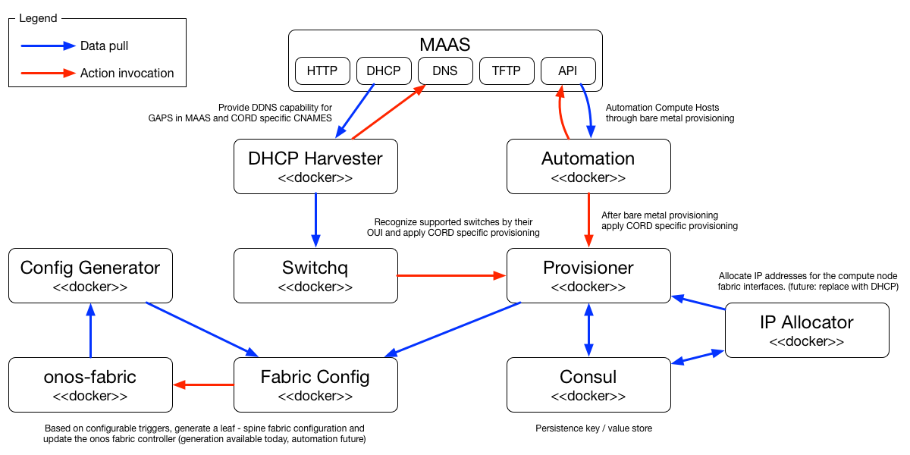

# API Documentation
There are a number of services that provide automation services for CORD. These
services are written in the theme of Docker based micro(µ) services. Each runs
independently in its own container and they consume the other µ services via
REST API calls as well as provide a REST API through which other services can
utilize their functions.

The current list of µ services are:
   * **automation** automates bare metal compute hosts through the MAAS
    deployment life cycle and invokes CORD specific provisioning
   * **provisioner** applies CORD specific provisioning to compute nodes and
    fabric switches
   * **switchq** identifies supported fabric switches and invokes CORD specific
    provisioning
   * **allocator** allocates IP addresses from a specified range to be used
    for interfaces attached to the leaf - spine fabric
   * **harvester** augments MAAS's DDNS capability to support all devices that
    request a DHCP address
   * **config-generator** generates a configuration file for the ONOS leaf -
    spine (segment routing) fabric

 

## Automation
**Docker image:** cord-maas-automation

### Configuration
|Environment Variable|Default|Description|
|-|-|-|
|AUTOMATION_POWER_HELPER_USER|"cord"|User ID to use when attempting to execute vboxmanage on the host machine|
|AUTOMATION_POWER_HELPER_HOST|"127.0.0.1"|IP address of the host on which to execute vboxmanage commands|
|AUTOMATION_POWER_HELPER_SCRIPT|""|Script to execute to help manage power for VirtualBox nodes in MAAS|
|AUTOMATION_PROVISION_URL|""|URL on which to contact the provision services|
|AUTOMATION_PROVISION_TTL|"1h"|Amount of time to wait for a provisioning to complete before considering it failed|
|AUTOMATION_LOG_LEVEL|"warning"|Level of logging messages to display|
|AUTOMATION_LOG_FORMAT|text"|Format of the log messages|

|Command Line Flag|Default|Description|
|-|-|-
|-apikey|""|key with which to access MAAS server|
|-maas|"http://localhost/MAAS"|url over which to access MAAS|
|-apiVersion|"1.0"|version of the API to access|
|-queryPeriod|"15s"|frequency the MAAS service is polled for node states|
|-preview|false|displays the action that would be taken, but does not do the action, in this mode the nodes are processed only once|
|-mappings|"{}"|the mac to name mappings|
|-always-rename|true|attempt to rename at every stage of workflow|
|-filter|'{"hosts":{"include":[".*"],"exclude":[]},"zones":{"include": ["default"],"exclude":[]}}'|constrain by hostname what will be automated|

### REST Resources
None

## Provisioner
**Docker image:** cord-provisioner

### Configuration
|Environment Variable|Default|Description|
|-|-|-|
|PROVISION_PORT|"4243"|Port on which to listen for REST requests|
|PROVISION_LISTEN|"0.0.0.0"|IP address on which to listen for REST requests|
|PROVISION_ROLE_SELECTOR_URL|""|URL of a service that can be queried to determine the role that should be used for a given node, else the default is used|
|PROVISION_DEFAULT_ROLE|"compute-node"|the default role to be used if no selection URL is specified|
|PROVISION_SCRIPT|"do-ansible"|script to execute for a provisioning event|
|PROVISION_STORAGE_URL|"memory:"|URL to use for storage of provisioning state information|
|PROVISION_LOG_LEVEL|"warning"|Level of logging messages to display|
|PROVISION_LOG_FORMAT|text"|Format of the log messages|

### REST Resources
|URI|Operation|Description|
|-|-|-|
|/provision/|POST|create a new provisioning request|
|/provision/|GET|get a list of all provisioning requests and their state|
|/provision/{id}|GET|get a single provisioning request and state|
|/provision/{id}|DELETE|delete a provisioning request|

##### POST /provision/
`POST`s to this URL will initiate a new provisioning request. This requests
requires that a provisioning request object is sent as data to the request.

This request returns a `201 Accepted` response, if the request was successfully
queued for provisioning.

The request is a `JSON` objects with the following members:

|Name|Type|Required|Description|
|-|-|-|-|
|id|string|yes|unique ID to use for the request|
|name|string|yes|human readable name for the node being provisioned|
|ip|string|yes|IP address of the node being provisioned|
|mac|string|no|MAC address associated with the node being provisioned|
|role_selector|string|no|URL for a per request role selector service|
|role|string|no|role to provision for this request, if no selector specified|
|script|string|no|script to execute for this provisioning request|

Example:
```
{
    "id": "node-fe30a9c4-4a30-11e6-b7a3-002590fa5f58"
    "name": "lively-road.cord.lab",
    "ip": "10.2.0.16",
    "mac": "00:25:90:fa:5f:4f",
    "role_selector": "",
    "role": "",
    "script": "",
}
```
##### GET /provision/
Fetches the list of all provisioning requests and their state information. The
result is a JSON array such as the example below:

|Name|Type|Description|
|-|-|-|
|timestamp|number|time that the request was made|
|message|string|error message if the request failed|
|status|number|the status of the request, 0=pending,1=provisioning,2=complete,3=failed|
|worker|number|internal identifier of the worker that executed the provisioning request|
|request.Role|string|actual role used for the request|
|request.Script|string|actual script used for the request|
|request.Info|object|the original request made to the provisioner|

```
[
  {
    "timestamp": 1469550527,
    "message": "",
    "status": 2,
    "worker": 2,
    "request": {
      "Role": "compute-node",
      "Script": "/etc/maas/ansible/do-ansible",
      "Info": {
        "script": "",
        "role": "",
        "role_selector": "",
        "mac": "00:25:90:fa:5f:53",
        "ip": "10.2.0.15",
        "name": "bitter-prison.cord.lab",
        "id": "node-fe205272-4a30-11e6-a48d-002590fa5f58"
      }
    }
  },
  {
    "timestamp": 1468544505,
    "message": "",
    "status": 2,
    "worker": 0,
    "request": {
      "Role": "fabric-switch",
      "Script": "/etc/maas/ansible/do-switch",
      "Info": {
        "script": "/etc/maas/ansible/do-switch",
        "role": "fabric-switch",
        "role_selector": "",
        "mac": "cc:37:ab:7c:ba:da",
        "ip": "10.2.0.5",
        "name": "leaf-2",
        "id": "cc:37:ab:7c:ba:da"
      }
    }
  }
]
```

##### GET /provision/{id}
Fetches the provisioning request and state for a single specified ID. The
result is a single JSON object as described below:

|Name|Type|Description|
|-|-|-|
|timestamp|number|time that the request was made|
|message|string|error message if the request failed|
|status|number|the status of the request, 0=pending,1=provisioning,2=complete,3=failed|
|worker|number|internal identifier of the worker that executed the provisioning request|
|request.Role|string|actual role used for the request|
|request.Script|string|actual script used for the request|
|request.Info|object|the original request made to the provisioner|

```
{
  "timestamp": 1469550527,
  "message": "",
  "status": 2,
  "worker": 2,
  "request": {
    "Role": "compute-node",
    "Script": "/etc/maas/ansible/do-ansible",
    "Info": {
      "script": "",
      "role": "",
      "role_selector": "",
      "mac": "00:25:90:fa:5f:53",
      "ip": "10.2.0.15",
      "name": "bitter-prison.cord.lab",
      "id": "node-fe205272-4a30-11e6-a48d-002590fa5f58"
    }
  }
}
```

##### DELETE /provision/{id}
Removes a request from the provisioner. If the request is inflight the request
will be completed before it is removed.

## Switchq
** Docker image:** cord-maas-switchq

### Configuration
|Environment Variable|Default|Description|
|-|-|-|
|SWITCHQ_VENDORS_URL|"file:///switchq/vendors.json"|URL from which a structure can be read that identifies the supported vendor OUIs|
|SWITCHQ_ADDRESS_URL|"file:///switchq/dhcp_harvest.inc"|URL from which the service should obtain device IP / MAC information for known devices|
|SWITCHQ_POLL_INTERVAL|"1m"|Interval at which a check should be made for new devices|
|SWITCHQ_PROVISION_TTL|"1h"|how often the switches will be re-provisioned|
|SWITCHQ_PROVISION_URL|""|the URL on which to contact the provisioner to make provisioning requests|
|SWITCHQ_ROLE_SELECTOR_URL|""|URL of a service that can be queried to determine the role that should be used for a given node, else the default is used|
|SWITCHQ_DEFAULT_ROLE|"fabric-switch"|the default role to be used if no selection URL is specified|
|SWITCHQ_SCRIPT|"do-ansible"|script to execute for a provisioning event|
|SWITCHQ_LOG_LEVEL|"warning"|Level of logging messages to display|
|SWITCHQ_LOG_FORMAT|"text"|Format of the log messages|

### REST Resources
None

## Allocator
**Docker image:** cord-ip-allocator

### Configuration
|Environment Variable|Default|Description|
|-|-|-|
|ALLOCATE_PORT|"4242"|port on which to listen for requests|
|ALLOCATE_LISTEN|"0.0.0.0"|IP address on which to listen for requests|
|ALLOCATE_NETWORK|"10.0.0.0/24"|Subnet from which address should be allocated|
|ALLOCATE_SKIP|"1"|number of host addresses to skip in the subnet before allocation range|
|ALLOCATE_LOG_LEVEL|"warning"|Level of logging messages to display|
|ALLOCATE_LOG_FORMAT|"text"|Format of the log messages|

### REST Resources
|URI|Operation|Description|
|-|-|-|
|/allocations/{mac}|DELETE|delete allocation for a specific MAC|
|/allocations/{mac}|GET|return the allocation for a specific MAC|
|/allocations/|GET|return the list of all allocations|
|/addresses/{ip}|DELETE|delete the allocation associated with a specific IP|

##### DELETE /allocations/{mac}
If the specified MAC address is associated with an IP address this allocation /
association is deleted.

##### GET /allocations/{mac}
Returns the IP address associated with the specified MAC, if no association
exists then an IP address is allocated form the range, associated with the MAC,
and returned.

|Name|Type|Description|
|-|-|-|
|Ip|string|IP address associated with the specified MAC|
|MAC|string|MAC address|

Example:
```
{
  "Ip": "10.6.1.4",
  "Mac": "00:25:90:fa:5f:79"
}
```

##### GET /allocations/
Returns a list of all known MAC to IP associations.

|Name|Type|Description|
|-|-|-|
|Ip|string|IP address associated with the specified MAC|
|MAC|string|MAC address|

Example:
```
[
  {
    "Ip": "10.6.1.4",
    "Mac": "00:25:90:fa:5f:79"
  },
  {
    "Ip": "10.6.1.2",
    "Mac": "00:25:90:fa:5f:53"
  },
  {
    "Ip": "10.6.1.3",
    "Mac": "00:25:90:fa:5f:4f"
  }
]
```

##### DELETE /allocations/{ip}
If the specified IP is associated with a MAC address this association is
deleted.

## Harvester
**Docker image:** cord-dhcp-harvester

### Configuration
|Command Line Flag|Default|Description|
|-|-|-|
|'-l', '--leases'|'/dhcp/dhcpd.leases'|specifies the DHCP lease file from which to harvest|
|'-x', '--reservations'|'/etc/dhcp/dhcpd.reservations'|specified the reservation file as ISC DHCP doesn't update the lease file for fixed addresses|
|'-d', '--dest'|'/bind/dhcp_harvest.inc'|specifies the file to write the additional DNS information|
|'-i', '--include'|None|list of hostnames to include when harvesting DNS information|
|'-f', '--filter'|None|list of regex expressions to use as an include filter|
|'-r', '--repeat'|None|continues to harvest DHCP information every specified interval|
|'-c', '--command'|'rndc'|shell command to execute to cause reload|
|'-k', '--key'|None|rndc key file to use to access DNS server|
|'-s', '--server'|'127.0.0.1'|server to reload after generating updated dns information|
|'-p', '--port'|'954'|port on server to contact to reload server|
|'-z', '--zone'|None|zone to reload after generating updated dns information|
|'-u', '--update'|False, action='store_true'|update the DNS server, by reloading the zone|
|'-y', '--verify'|False, action='store_true'|verify the hosts with a ping before pushing them to DNS|
|'-t', '--timeout'|'1s'|specifies the duration to wait for a verification ping from a host|
|'-a', '--apiserver'|'0.0.0.0'|specifies the interfaces on which to listen for API requests|
|'-e', '--apiport'|'8954'|specifies the port on which to listen for API requests|
|'-q', '--quiet'|'1m'|specifieds a minimum quiet period between actually harvest times.|
|'-w', '--workers'|5|specifies the number of workers to use when verifying IP addresses|

### REST Resources

|URI|Operation|Description|
|-|-|-|
|/harvest|POST|Forces the service to perform an IP harvest against the DHCP
server and update DNS|

##### POST /harvest
The service periodically harvests IP information from the specified DHCP
server and updates DNS zones accordingly. This request force an harvest to
be performed immediately.

## config-generator
**Docker image:** cord-config-generator

### Configuration
|Environment Variable|Default|Description|
|-|-|-|
|CONFIGGEN_PORT|"8181"|port on which to contact ONOS|
|CONFIGGEN_IP|"127.0.0.1"|IP on which to contact ONOS|
|CONFIGGEN_SWITCHCOUNT|"0"|number of switches expected to be found in ONOS when generating a configuration|
|CONFIGGEN_HOSTCOUNT|"0"|number of hosts expected to be found in ONOS when generating a configuration|
|CONFIGGEN_USERNAME|"karaf"|username to use when invoking requests to ONOS|
|CONFIGGEN_PASSWORD|"karaf"|password to use when invoking request to ONOS|
|CONFIGGEN_LOGLEVEL|"warning"|Level of logging messages to display|
|CONFIGGEN_LOGFORMAT|"text"|Format of the log messages|
|CONFIGGEN_CONFIGSERVERPORT|"1337"|port on which to listen for configuration generation requests|
|CONFIGGEN_CONFIGSERVERIP|"127.0.0.1"|IP on which to listen for configuration generation requests|

### REST Resources
|URI|Operation|Description|
|-|-|-|
|/config/|POST|Generates and returns a CORD leaf - spine configuration file|

##### POST /config/
This request will interrogate the specified ONOS instance and if the expected
number of switches and hosts are in ONOS it will then generate a configuration
file suitable to use for the CORD leaf - spine fabric and return that to the
caller.

|Name|Type|Required|Description|
|-|-|-|-|
|switchcount|number|yes|number of hosts expected to be found in ONOS when generating a configuration|
|hostcount|number|yes|number of hosts expected to be found in ONOS when generating a configuration|

*example:*
```
{
    "switchcount" : 4,
    "hostcount" : 4
}
```
