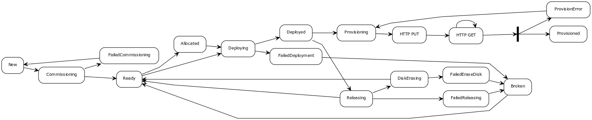

# Metal as a Service Automation (maas-flow)
This is a utility that works in conjunction with an Ubuntu Metal as a Service
([MAAS](http://maas.io)) deployment. By default, the MAAS system allows an
operator to manually control the lifecycle of a compute host as it comes on
line leveraging PXE, DHCP, DNS, etc.

The utility leverages the MAAS REST API to periodically monitor the **status**
of the hosts under control of MAAS and continuous attempts to move those hosts
into a **deployed** state. (Note: this will likely change in the future to
support additional target states.)

### Filtering Hosts on which to Operate
Using a filter the operator can control on which hosts automation acts. The
filter is a basic **JSON** object and can either be specified as a string on
the command line or a file which contains the filter. When specifying a file
the value of the **-filter** command line option should be a **@** followed by
the name of the file, i.e. @$HOME/some/file, and it may container environment
variable.

The structure of the filter object is:
```
{
    "hosts" : {
        "include" : [],
        "exclude" : []
    },
    "zones" : {
        "include" : [],
        "exclude" : []
    }
}
```
For **hosts** the **include** and **exclude** values are a list of regular
expressions which are mapped against the hostname of a device under control of
MAAS.

for **zones** the **include** and **exclude** values are a list of regular
expression which are mapped against the zone with which a host is associated.

When both **include** and **exclude** values are specified the **include**
is processed followed by the **exclude**.

The default filter, if none is specified, is depicted below. Essentially it
specifies that the automation will act on all hosts in only the **default**
zone. (*NOTE: This default filter may change in the future.*)
```
{
  "hosts" : {
    "include" : [],
    "exclude" : []
  },
  "zones" : {
    "include" : ["default"],
    "exclude" : []
  }
}
```

*NOTE:* only include is currently (January 26, 2016) supported.

### Connecting to MAAS
The connection to MAAS is controlled by command line parameters, specifically:
* **-apiVersion** - (default: *1.0*) specifies the version of the MAAS API to use
* **-apiKey** - (default: *none*) specifies the API key to use to authenticate to
the MAAS server. For a given user this can be found on under their account
settings in the MAAS UI. This value is important as the automation is acting
on behalf of this user and the SSH keys that are pushed to hosts will be the
SSH keys associated with this user.
* **-maas** - (default: *http://localhost/MAAS*) specifies the base URL on which
to contact the MAAS server.
* **-period** - (default: *15s*) specifies how often the automation queries the
MAAS server to retrieve the state of the hosts. Automation must query the state
of the hosts from MAAS as MAAS does not support an asynchronous change
mechanism today. This value should be set such that the automation can fully
process all the hosts within a period.

### Docker Image
The project contains a `Dockerfile` that can be used to construct a docker
image from the repository. The docker image is also provided via Docker Hub at
https://hub.docker.com/r/ciena/maas-flow/.

### State machine
The state machine on which the MAAS automation is based is depicted below.
Currently (January 26, 2016) the automation only supports a deployed target
state and will not act on hosts that are in a failed, broken, or error state.

